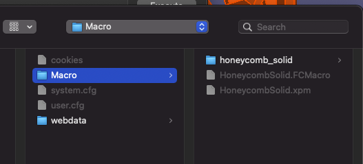

# 3d-printing-pencil-holders

Parametric Pencil Holders builded using [FreeCAD](https://www.freecadweb.org/) and the [HoneycombSolid Macro](https://github.com/christiangda/FreeCAD-macros-HoneycombSolid)

## Requirements

* [FreeCAD](https://www.freecadweb.org/) >= 1.19
* [HoneycombSolid Macro](https://github.com/christiangda/FreeCAD-macros-HoneycombSolid)

The [FreeCAD HoneycombSolid Macro](https://github.com/christiangda/FreeCAD-macros-HoneycombSolid) is part of the [FreeCAD-macros](https://github.com/FreeCAD/FreeCAD-macros) repository.
## References

* https://www.freecadweb.org/
* https://github.com/FreeCAD/FreeCAD-macros
* https://github.com/christiangda/FreeCAD-macros-HoneycombSolid

## Images

## License

This module is released under the GNU General Public License Version 3:

* [http://www.gnu.org/licenses/gpl-3.0-standalone.html](http://www.gnu.org/licenses/gpl-3.0-standalone.html)

## Author Information

* [Christian González Di Antonio](https://github.com/christiangda)
